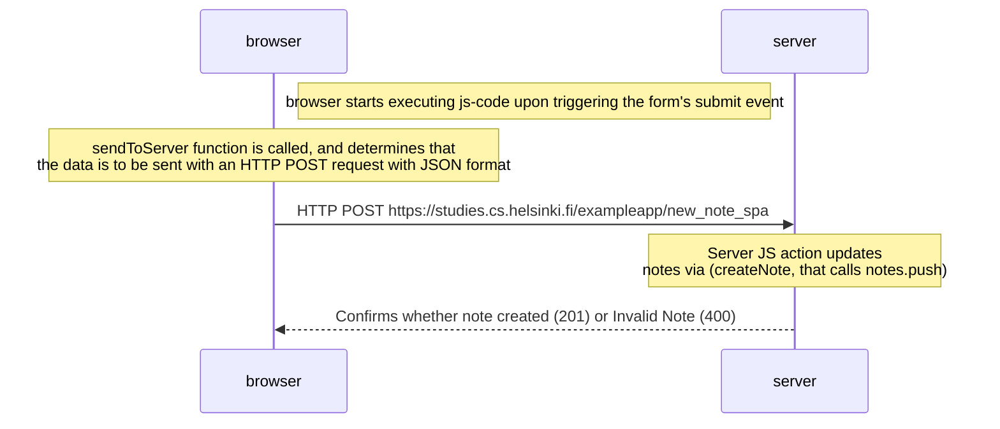

```mermaid
sequenceDiagram
  participant browser
  participant server
  
  note right of browser: browser starts executing js-code upon triggering the form's submit event
  note over browser: sendToServer function is called, and determines that <br> the data is to be sent with an HTTP POST request with JSON format
  browser->>server: HTTP POST https://studies.cs.helsinki.fi/exampleapp/new_note_spa
  Note over server: Server JS action updates <br> notes via (createNote, that calls notes.push)
  server-->>browser: Confirms whether note created (201) or Invalid Note (400)
```
